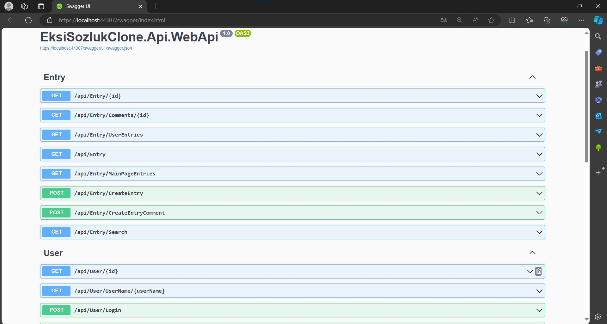
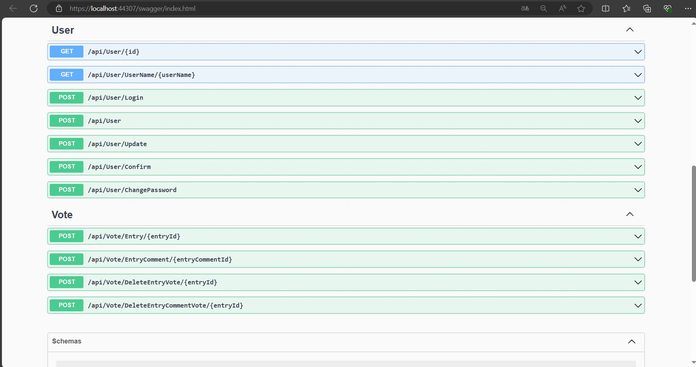

# Used Technologies

- Onion Architecture
- Data Seeding (Bogus)
- Generic Repository
- User Login (JWT Token)
- RabbitMQ (Create-Update User)
- MediatR Pattern
 
# Backend





- Get api/Entry/{id} : It is used to retrieve an entry with a specific ID.
- Get api/Entry/Comments/{id} : Used to retrieve comments of a particular entry.
- Get /api/Entry/UserEntries : It is used to retrieve inputs from a specific user.
- Get /api/Entry : Used to retrieve entries based on various criteria.
- Get /api/Entry/MainPageEntries : Used to retrieve homepage entries.
- Post /api/Entry/CreateEntry : Used to create a new entry.
- Post /api/CreateEntryComment : Used to add a new comment to a specific entry.
- Get /Api/Entry/Search : It is used to search for "entry" based on certain criteria.
- Get /api/Search : Used to search for entries based on specific search criteria.
- Get /api/User/{id} : It is used to get a user with a specific id.
- Get /api/User/UserName/{userName} : It is used to retrieve a user with a specific userName.
- Post /api/User/Login : It is used for user login.
- Post /api/User : Used to create a new user.
- Post /api/User/Update : Used to update an existing user.
- Post /api/User/Confirm : Used to confirm a user's email address.
- Post /api/User/ChangePassword : Used to change a user's password.
- Post /api/Vote/Entry/{entryId} : Used to vote for a specific entry.
- Post /api/Vote/EntryComment/{entryCommentId} : Used to vote for a specific entry comment.
- Post /api/Vote/DeleteEntryVote/{entryId} : Used to delete a vote for a specific entry.
- Post /api/Vote/DeleteEntryCommentVote/{entryCommentId} : Used to delete a vote for a specific entry comment.
- Post /api/Favorite/entry/{entryId} : Used to add favorites for the specified entryId.
- Post /api/Favorite/entrycomment/{entrycommentId} : Used to add favorites for the specified entrycommentId (comment ID).
- Post /api/Favorite/deleteentryfav/{entryId} : Used to delete the favorite for the specified entryId
- Post /api/Favorite/deleteentrycommentfav/{entrycommentId} : Used to delete the favorite for the specified entrycommentId (comment ID)
  
# Usage

## Prerequisites

Before you begin, ensure you have met the following requirements:
- .NET Core SDK installed 
- PostgreSQL installed and running
- An IDE or text editor such as Visual Studio or Visual Studio Code

## Setup
1. **Clone the repository**

    ```bash
    git clone https://github.com/berfin-t/EksiSozlukClone.git
    cd EksiSozlukClone
    ```
2. **Configure PostgreSQL**

    Create a PostgreSQL database and update the connection string in `appsettings.json` or your environment variables.

    ```json
    "ConnectionStrings": {
        "DefaultConnection": "Host=localhost;Database=yourdatabase;Username=yourusername;Password=yourpassword"
    }
    ```
3. **Apply Migrations**

    Apply the EF Core migrations to your PostgreSQL database to set up the schema.

    ```bash
    dotnet ef database update
    ```
## Running the Application

1. **Restore the dependencies**

    ```bash
    dotnet restore
    ```
2. **Build the project**

    ```bash
    dotnet build
    ```
3. **Run the application**

    ```bash
    dotnet run
    ```
