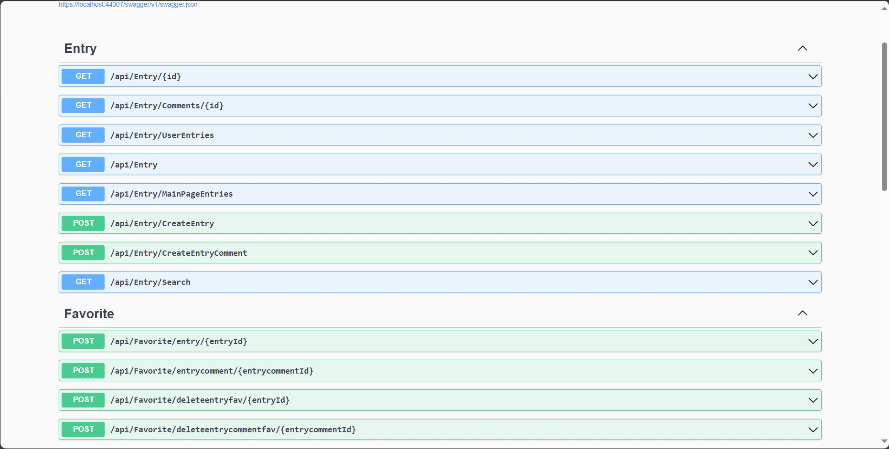

# Used Technologies

- Onion Architecture
- Data Seeding (Bogus)
- Generic Repository
- User Login (JWT Token)
- RabbitMQ (Create-Update User)
- MediatR Pattern
 
# Backend




# Usage

## Prerequisites

Before you begin, ensure you have met the following requirements:
- .NET Core SDK installed 
- PostgreSQL installed and running
- An IDE or text editor such as Visual Studio or Visual Studio Code

## Setup
1. **Clone the repository**

    ```bash
    git clone https://github.com/berfin-t/EksiSozlukClone.git
    cd EksiSozlukClone
    ```
2. **Configure PostgreSQL**

    Create a PostgreSQL database and update the connection string in `appsettings.json` or your environment variables.

    ```json
    "ConnectionStrings": {
        "DefaultConnection": "Host=localhost;Database=yourdatabase;Username=yourusername;Password=yourpassword"
    }
    ```
3. **Apply Migrations**

    Apply the EF Core migrations to your PostgreSQL database to set up the schema.

    ```bash
    dotnet ef database update
    ```
## Running the Application

1. **Restore the dependencies**

    ```bash
    dotnet restore
    ```
2. **Build the project**

    ```bash
    dotnet build
    ```
3. **Run the application**

    ```bash
    dotnet run
    ```
